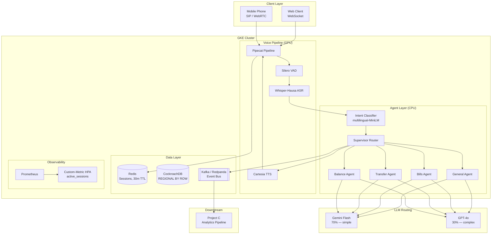

# Hausa Voice Swarm

**Production Voice Agents for West African Mobile Money**

Voice-first customer support for mobile money operators serving 10M+ monthly interactions in Hausa and English. Built for 2G/3G networks and low-literacy users: short responses, confirmation-gated financial actions, sub-800ms voice-to-voice latency.

---

## The Problem

Mobile money is the dominant financial infrastructure in West Africa, yet customer support is bottlenecked by human call centers that can't scale during peak hours. Existing voice AI solutions fail here because:

- **Hausa** is a 70M+ speaker language with almost no commercial ASR/TTS support
- **Code-switching** between Hausa and English is the norm, not the exception
- **2G/3G networks** impose hard latency and bandwidth constraints
- **Low-literacy users** need concise, confirmation-gated interactions (max 2 sentences per response)
- **Financial safety** demands explicit confirmation before any mutation (transfers, bill payments)

This system handles balance checks, money transfers, bill payments, and general support entirely by voice, routing between 4 specialized agents with cost-optimized LLM selection.

---

## Architecture



---

## At a Glance

| Metric | Value |
|---|---|
| Domain agents | 4 (balance, transfer, bills, general) |
| Supported intents | 11 across Hausa + English code-switching |
| Autoscaling | Custom HPA on `active_voice_sessions` (2-50 pods) |
| Concurrent sessions | 50+ tested, HPA supports up to 4,500 |
| Target latency | < 800ms voice-to-voice |
| Cost per interaction | $0.007-0.014 at 10M/month scale |
| LLM routing | 70% Gemini Flash / 30% GPT-4o via LiteLLM |
| Test coverage | 128 tests (unit + integration), k6 load suite |

---

## Technical Decisions

| Decision | Choice | Rationale |
|---|---|---|
| Voice orchestration | Pipecat | Frame-based processor model, async-native, pluggable transports |
| Agent orchestration | LangGraph | Supervisor-worker pattern, state graph, conditional routing |
| LLM cost routing | LiteLLM (70/30 Flash/GPT-4o) | 33x cost reduction on simple queries, config-only ratio changes |
| Customer data | CockroachDB `REGIONAL BY ROW` | Row-level geo-pinning, serializable isolation for financial data |
| Session state | Redis (TTL 30 min) | Sub-ms reads, TTL-based cleanup, fakeredis for testing |
| Event bus | Kafka (Redpanda) | Durable log, 4 topics, decoupled consumers for Project C |
| Intent classifier | multilingual-MiniLM-L6-v2 | 50+ languages, 5ms inference, zero API cost |
| Package manager | uv | 10-100x faster than pip, deterministic lockfile |
| Autoscaling | Custom HPA on Prometheus metric | CPU/memory doesn't reflect voice session load |

Full ADRs: [docs/DECISIONS.md](docs/DECISIONS.md)

---

## Quick Start

### Prerequisites

- Python 3.12+
- Docker & Docker Compose

### Install uv (if not installed)

```bash
curl -LsSf https://astral.sh/uv/install.sh | sh
```

### Setup

```bash
git clone https://github.com/moritzkazooba-wq/Hausa-Voice-Swarm.git
cd Hausa-Voice-Swarm
cp .env.example .env
uv sync
```

### Run locally

```bash
# Start infrastructure (Redis, CockroachDB, Redpanda, Prometheus)
make dev-up

# Run unit + integration tests
make test

# Run end-to-end tests (requires docker-compose stack)
make test-e2e
```

### Demo

```bash
# Simulate a voice call (text mode)
curl -s -X POST http://localhost:8000/test/simulate-call \
  -H "Content-Type: application/json" \
  -d '{"phone_number": "+2348012345678", "utterance": "Ina so in biya kudin wutar lantarki"}' | jq

# Balance check
curl -s -X POST http://localhost:8000/test/simulate-call \
  -H "Content-Type: application/json" \
  -d '{"phone_number": "+2348012345678", "utterance": "What is my balance?"}' | jq

# GraphQL query
curl -s -X POST http://localhost:8000/graphql \
  -H "Content-Type: application/json" \
  -d '{"query": "{ accountBalance(phoneNumber: \"+2348012345678\") { name balance currency } }"}' | jq

# Health check
curl http://localhost:8000/health

# Prometheus metrics
curl http://localhost:8000/metrics
```

---

## Project Structure

```
src/
├── voice/          # Pipecat pipeline: VAD → ASR → filler → bridge → TTS
├── agents/         # LangGraph supervisor + 4 domain agents + intent classifier
│   └── domains/    # balance, transfer, bills, general
├── api/            # FastAPI + Strawberry GraphQL, DataLoaders
├── models/         # Pydantic v2 models (strict mode)
├── config/         # pydantic-settings (8 config classes, .env loading)
├── db/             # CockroachDB engine, Redis session store, repositories
├── events/         # Kafka producer/consumer, 5 event schemas
├── metrics/        # Prometheus metrics (12 definitions) + HTTP middleware
└── utils/          # structlog configuration

tests/              # 128 tests, layered conftest fixtures
benchmarks/         # k6 load tests (smoke, local, ramp, sustained, burst, chaos)
k8s/                # Kubernetes manifests (deployments, HPA, PDB, NetworkPolicy)
infrastructure/     # Terraform modules (GKE, networking)
docs/               # Architecture, cost model, ADRs, implementation log
```

---

## Tech Stack

| Layer | Technology | Purpose |
|---|---|---|
| Voice pipeline | Pipecat | Frame-based real-time audio processing |
| VAD | Silero | Voice activity detection (300ms pad, 0.5 threshold) |
| ASR | Whisper-Hausa / Intron | Speech-to-text for Hausa + English |
| TTS | Cartesia / Intron | Text-to-speech with Hausa voice |
| Agent orchestration | LangGraph | Supervisor-worker multi-agent routing |
| Intent classification | sentence-transformers | multilingual-MiniLM-L6-v2 embeddings |
| LLM abstraction | LiteLLM | Cost-based routing (Flash / GPT-4o) |
| API | FastAPI + Strawberry | GraphQL with DataLoader batching |
| Session store | Redis | 30-min TTL, sub-ms access |
| Database | CockroachDB | `REGIONAL BY ROW` multi-region |
| Event bus | Kafka (Redpanda) | 4 topics: intents, tools, sessions, escalations |
| Metrics | Prometheus | Custom HPA metric + 12 application metrics |
| Container | Docker | Multi-stage uv build |
| Orchestration | Kubernetes (GKE) | Custom-metric HPA, PDB, NetworkPolicy |
| IaC | Terraform | GKE cluster, networking, IAM |
| Package manager | uv | Deterministic lockfile, fast installs |
| Linting | ruff | PEP 8, import sorting, security rules |
| Type checking | mypy (strict) | Full type coverage, no `Any` in public APIs |
| Testing | pytest + pytest-asyncio | 128 tests, async-native, fakeredis |
| Load testing | k6 | Smoke, ramp, sustained, burst, chaos scenarios |

---

## Load Testing

k6 test suite with local and cluster scenarios:

```bash
make load-smoke       # 1 VU, 5 iterations — sanity check
make load-local       # 1→10 VUs, 5 min — local load test
make load-ramp        # 1→50 VUs, 10 min (requires GKE)
make load-sustained   # 50 VUs, 30 min (requires GKE)
make load-burst       # 10→100 VU spike (requires GKE)
make load-chaos       # 50 VUs + pod kill (requires GKE)
make load-report      # Generate markdown report from Prometheus
```

See [docs/COST-MODEL.md](docs/COST-MODEL.md) for per-interaction cost analysis at 10M/month scale.

---

## Portfolio Integration

This is **Project B** in a 3-project portfolio:

### From Project A: Whisper-Hausa Fine-Tuned ASR

The fine-tuned Whisper model from Project A provides Hausa speech recognition. In production, set `WHISPER_MODEL_PATH` to the model artifact path. The system falls back to Intron's cloud ASR API when the local model is unavailable.

```bash
# Use self-hosted Whisper-Hausa model
WHISPER_MODEL_PATH=/models/whisper-hausa-v1
USE_REAL_ASR=true
ASR_PROVIDER=whisper
```

### To Project C: Analytics Pipeline

All voice interactions emit structured Kafka events consumed by Project C's analytics dashboard:

- `hsv.intents` — intent classification results (utterance, confidence, model)
- `hsv.tools` — agent tool executions (agent, tool, success, duration)
- `hsv.sessions` — session lifecycle (start, end, duration, turns)
- `hsv.escalations` — human escalation triggers (agent, reason, priority)

Redis session state is available for real-time dashboard queries via the GraphQL API.

---

## Telephony

Demo mode uses WebRTC/text via `/test/simulate-call`. For production telephony:

```
# Telnyx SIP trunk
TELEPHONY_PROVIDER=telnyx
TELNYX_API_KEY=xxx
TELNYX_SIP_URI=sip:xxx@sip.telnyx.com

# Daily WebRTC
TELEPHONY_PROVIDER=daily
DAILY_API_KEY=xxx
DAILY_ROOM_URL=https://your-domain.daily.co/room
```

---

## References

- [Whisper-Hausa Fine-Tuning](https://arxiv.org/abs/2512.10968) — ASR for low-resource African languages
- [WAXAL](https://arxiv.org/abs/2510.07221) — West African language benchmark
- [Intron Sahara v2](https://intron.io) — Commercial Hausa ASR/TTS API
- [Pipecat](https://github.com/pipecat-ai/pipecat) — Open-source voice pipeline framework
- [LangGraph](https://github.com/langchain-ai/langgraph) — Multi-agent orchestration

---

## License

MIT
