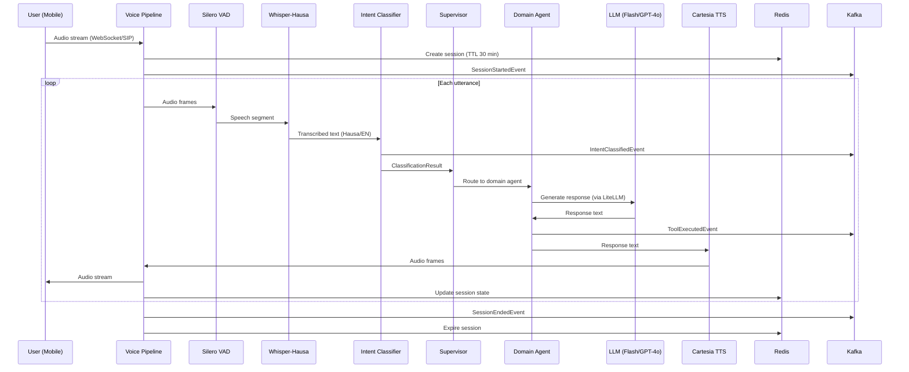
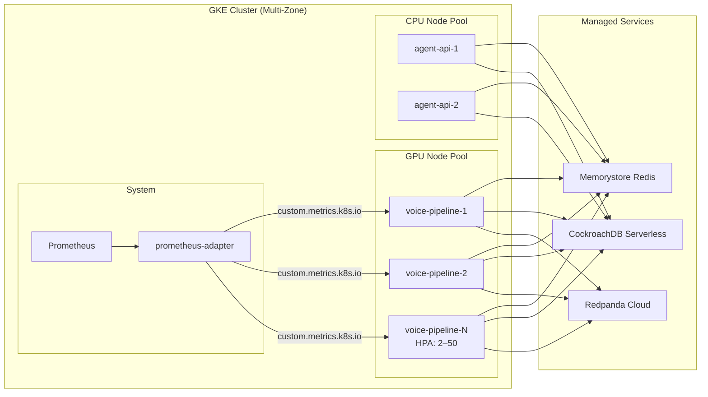

# Architecture — Hausa Voice Swarm

Voice agent system for mobile money customer support in Hausa (with English code-switching). Pipecat for voice orchestration, LangGraph for multi-agent routing, deployed on GKE.

---

## System Overview

```mermaid
graph TB
    subgraph "Client Layer"
        PHONE[📱 Mobile Phone<br/>3G+ / USSD fallback]
        WEB[🌐 Web Client<br/>WebSocket]
    end

    subgraph "Edge / Ingress"
        LB[GCP Load Balancer<br/>TLS termination]
    end

    subgraph "GKE Cluster"
        subgraph "Voice Pipeline (GPU Nodes)"
            VP[Pipecat Pipeline<br/>g2-standard-4]
            VAD[Silero VAD<br/>300ms pad, 0.5 threshold]
            ASR[Whisper-Hausa ASR<br/>Fine-tuned, Project A]
            TTS[Cartesia TTS<br/>Hausa voice]
            FILLER[Filler Processor<br/>Latency compensation]
        end

        subgraph "Agent Layer (CPU Nodes)"
            BRIDGE[Agent Bridge<br/>Pipecat ↔ LangGraph]
            INTENT[Intent Classifier<br/>multilingual-MiniLM-L6-v2]
            SUP[Supervisor Router<br/>LangGraph orchestrator]
            BAL[Balance Agent]
            TXN[Transfer Agent]
            BILL[Bills Agent]
            GEN[General Agent]
        end

        subgraph "API Layer"
            GQL[Strawberry GraphQL<br/>FastAPI]
            HEALTH[/health + /metrics]
        end

        subgraph "Data Layer"
            REDIS[(Redis<br/>Session cache<br/>TTL 30 min)]
            CRDB[(CockroachDB<br/>REGIONAL BY ROW<br/>Customer data)]
            KAFKA[[Redpanda / Kafka<br/>Event bus]]
        end

        subgraph "Observability"
            PROM[Prometheus<br/>Custom metrics]
            ADAPT[prometheus-adapter<br/>Custom metrics API]
            HPA[HPA v2<br/>active_sessions metric]
        end
    end

    subgraph "External APIs"
        LLM_FLASH[Gemini 2.0 Flash<br/>Simple queries, 70%]
        LLM_GPT[GPT-4o<br/>Complex queries, 30%]
        INTRON[Intron ASR API<br/>Fallback / cloud mode]
        CARTESIA[Cartesia TTS API]
    end

    subgraph "Downstream (Project C)"
        ANALYTICS[Analytics Pipeline<br/>Kafka consumer]
    end

    PHONE -->|SIP/WebRTC| LB
    WEB -->|WebSocket| LB
    LB --> VP

    VP --> VAD --> ASR --> FILLER --> BRIDGE
    BRIDGE --> TTS --> VP

    BRIDGE --> INTENT --> SUP
    SUP --> BAL & TXN & BILL & GEN
    BAL & TXN & BILL & GEN -->|LiteLLM| LLM_FLASH & LLM_GPT

    GQL --> REDIS & CRDB
    VP --> REDIS

    BRIDGE -->|Events| KAFKA
    KAFKA --> ANALYTICS

    PROM --> ADAPT --> HPA
    HPA -->|Scale| VP

    ASR -.->|Cloud fallback| INTRON
    TTS -.->|API| CARTESIA
```

---

## Request Flow



---

## Component Descriptions

### Voice Pipeline (`src/voice/`)

Pipecat-based real-time voice processing pipeline. Runs on GPU nodes (g2-standard-4) for ASR inference.

| Component | File | Purpose |
|---|---|---|
| Pipeline Factory | `pipeline.py` | Wires transport → VAD → ASR → filler → bridge → TTS → output |
| VAD | `vad_config.py` | Silero VAD: 300ms padding, 0.5 confidence, 0.8s endpointing |
| ASR | `asr.py` | Whisper-Hausa transcription (stub; real via `USE_REAL_ASR=true`) |
| TTS | `tts.py` | Cartesia speech synthesis (stub; real via `USE_REAL_TTS=true`) |
| Agent Bridge | `agent_bridge.py` | Connects Pipecat frames to LangGraph supervisor |
| Filler | `fillers.py` | Latency compensation when response exceeds 500ms |
| Transport | `transport.py` | Stub/Daily/Telnyx transport factory |
| WebSocket | `ws_server.py` | WebSocket server for browser/SIP gateway connections |

**Target latency:** < 800ms voice-to-voice on 3G+ networks.

### Agent Layer (`src/agents/`)

LangGraph orchestrator-worker pattern with intent-based routing.

| Component | File | Purpose |
|---|---|---|
| Intent Classifier | `intent.py` | multilingual-MiniLM-L6-v2 sentence embeddings → intent |
| Supervisor | `supervisor.py` | Routes to domain agent based on classification |
| Balance Agent | `domains/balance.py` | Account balance queries |
| Transfer Agent | `domains/transfer.py` | Money transfers (requires confirmation) |
| Bills Agent | `domains/bills.py` | Bill payments (requires confirmation) |
| General Agent | `domains/general.py` | FAQ, network status, catch-all |

**LLM routing:** LiteLLM abstracts model selection — 70% Gemini Flash (simple), 30% GPT-4o (complex).

### API Layer (`src/api/`)

Strawberry GraphQL over FastAPI.

| Endpoint | Purpose |
|---|---|
| `POST /graphql` | GraphQL queries and mutations |
| `GET /health` | Liveness/readiness probe |
| `GET /metrics` | Prometheus exposition format |
| `POST /test/simulate-call` | Text-mode pipeline testing |

DataLoaders prevent N+1 queries: `AccountLoader`, `TransactionLoader`.

### Data Layer

| Store | Purpose | Configuration |
|---|---|---|
| Redis (Memorystore) | Session state cache | TTL 30 min, 2GB HA instance |
| CockroachDB | Customer profiles, transactions | `REGIONAL BY ROW` for multi-region |
| Kafka (Redpanda) | Inter-service events | 4 topics: `hsv.intents`, `hsv.tools`, `hsv.sessions`, `hsv.escalations` |

### Observability (`src/metrics/`)

| Metric | Type | Labels |
|---|---|---|
| `hsv_active_voice_sessions` | Gauge | — |
| `hsv_voice_to_voice_latency_ms` | Histogram | — |
| `hsv_asr_latency_ms` | Histogram | model, intent |
| `hsv_tts_latency_ms` | Histogram | model, intent |
| `hsv_llm_latency_ms` | Histogram | model, intent |
| `hsv_intent_classification_total` | Counter | intent, classifier_type |
| `hsv_tool_execution_total` | Counter | tool_name, success |
| `hsv_cost_per_interaction_usd` | Histogram | — |

---

## Scaling Strategy

### Autoscaling

- **HPA v2** scales voice pipeline pods on `hsv_active_voice_sessions` custom metric
- Target: 5 sessions per pod (AverageValue)
- Range: 2–50 replicas
- Scale-up: +5 pods per 30s window (fast response to traffic spikes)
- Scale-down: -10% per 60s with 300s stabilization (conservative to avoid thrashing)

### Capacity Planning

| Load Tier | Concurrent Sessions | Voice Pods | API Pods |
|---|---|---|---|
| Baseline | 100 | 2 | 2 |
| Normal | 300 | 4 | 2 |
| Peak | 700–900 | 10–12 | 3 |
| Burst (2×) | 1,800 | 24 | 4 |
| Max (HPA limit) | 4,500 | 50 | 6 |

### Resilience

- **PodDisruptionBudget:** `minAvailable: 1` for both deployments
- **Graceful shutdown:** 300s termination for voice pipeline (drain active sessions)
- **NetworkPolicy:** voice ↔ api, api → db/redis/kafka (deny all else)
- **Multi-region CockroachDB:** `REGIONAL BY ROW` pins data to user's region

### Peak Hour Handling (40K–55K interactions/hour)

At peak: ~55,000 interactions/hour = ~15 interactions/second.

With avg 2-min voice sessions: ~700–900 concurrent at steady state.

HPA responds within 30s to session count increases. Pre-warmed node pool ensures GPU nodes are available within 2 minutes.

---

## Deployment Topology



---

## Cross-Project Integration

This project (B) sits between two companion projects:

| Project | Relationship | Interface |
|---|---|---|
| **Project A** — Whisper-Hausa Fine-Tuning | Upstream: provides ASR model | Model artifact consumed by `src/voice/asr.py` |
| **Project C** — Analytics Dashboard | Downstream: consumes events | Kafka topics `hsv.*` → `AnalyticsConsumer` |
